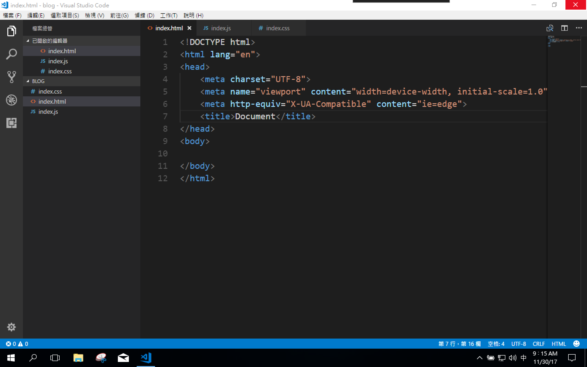
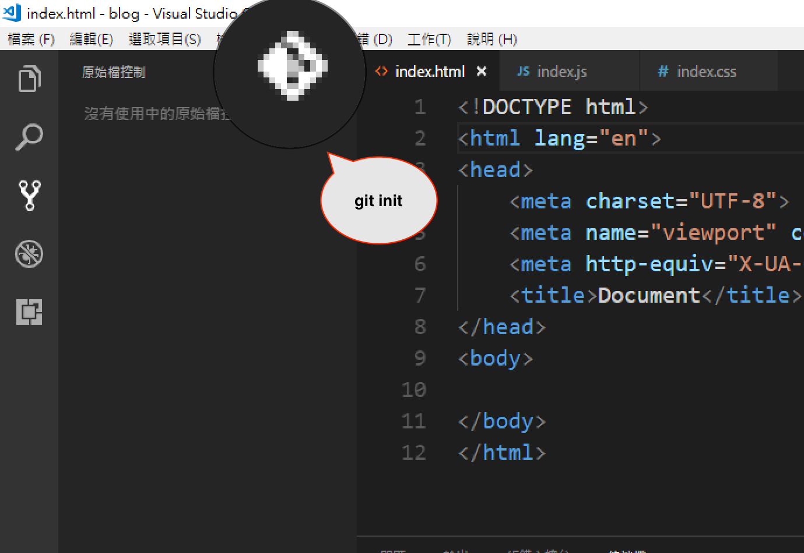
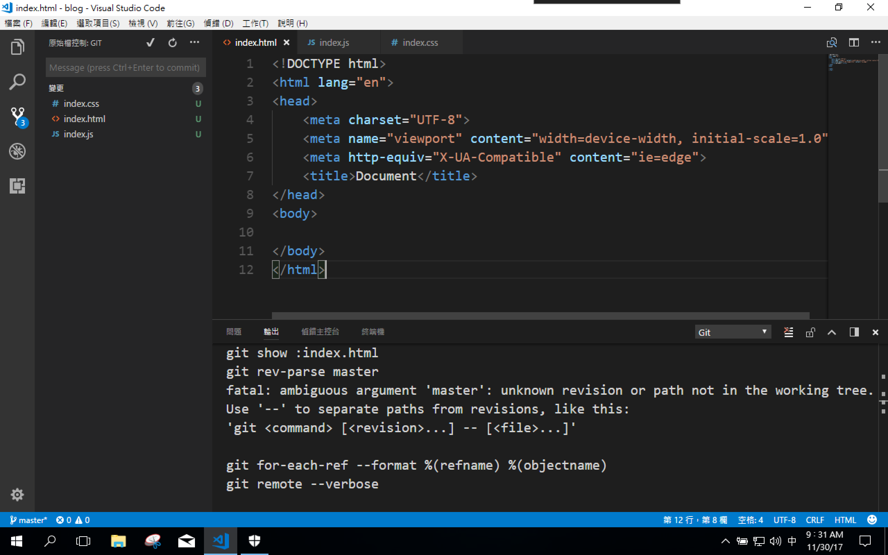
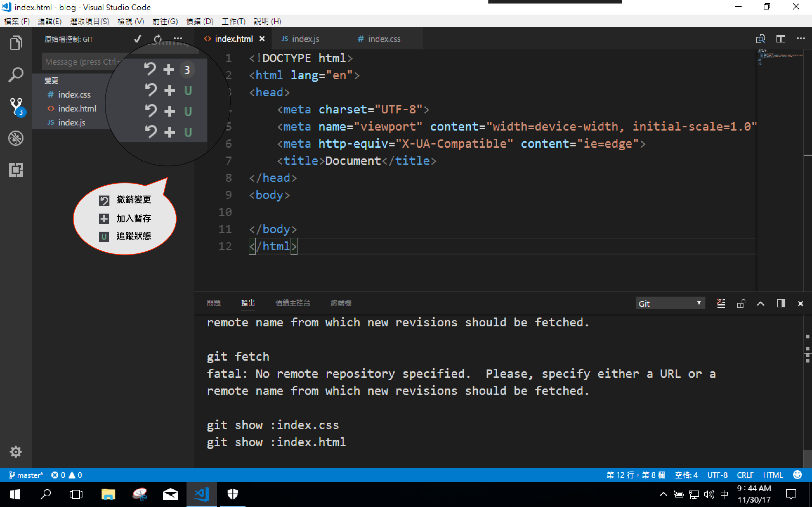
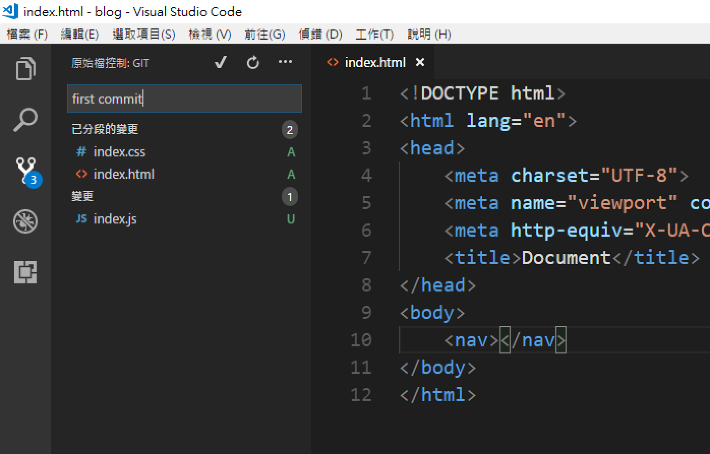
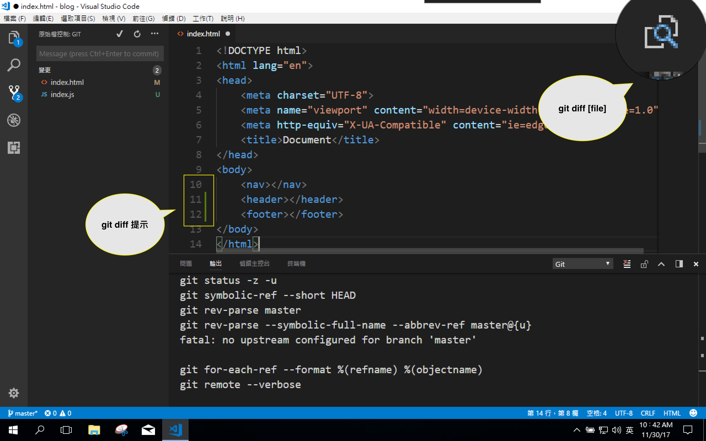
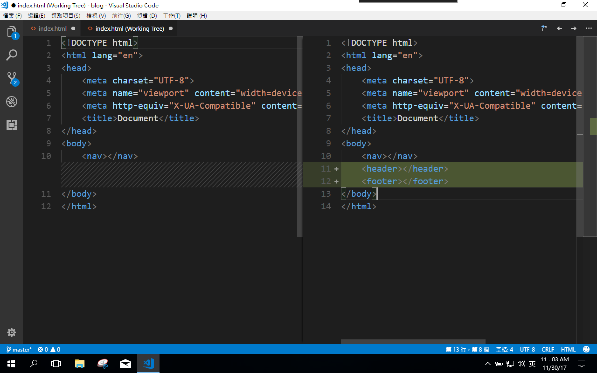
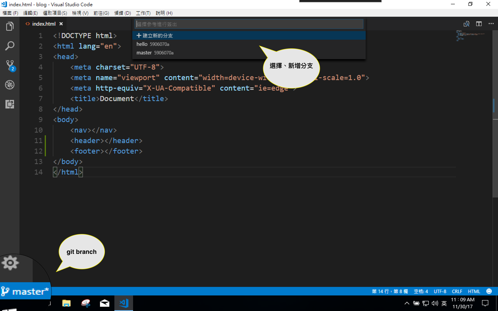

# 【vscode】來使用vscode開發吧(二)！
從上一章節我們知道了 vscode 和 visual studio 的差別，還有要如何取的安裝。讓我來說我們用 vs code 到底會有多方便吧！

## 支援多程式語言的高亮語法
原生支援相當多的語言開啟C#, VB, JavaScript, HTML, CSS, TypeScript, Ruby, Objective-C, PHP, JSON, Less, Sass 還有 Markdown⋯⋯。  
不知道自己輸入的語法是否正確？透過預設高亮(HighLight)、程式碼片段(CodeSnippet)能夠直覺的確定語法。支援語言非常多，有些原生沒有支援的也可以透過擴充套件去補足。

## vscode GUI 的 git 介面
對於 git 新手來說，把一條一條 git 指令記下來可能會有些困難，但vscode 將 git 工具整合進來，我們可以透過 vscode 去完成我們的版本控制。

使用前記得去下載符合自己環境的 git 工具--
https://git-scm.com。這之後我們就可以透過 GUI 介面來 git 囉！  

### git init
開啟現有專案資料夾

切換至版本控制功能

git 初始化完成

### 版本控制功能頁(git add .、git rm [file]、git status)
添加資料至暫存庫
  

git rm [file]  
![git rm [file]](./src/vscode_gitadd1.png)  
將該檔案變更移除。  
（無法復原！！）

git add .  
  
將檔案變更加入暫存。  
（等待commit）  

git status  
紅 D：刪除  
綠 A：新增  
灰 U：未追蹤  
藍 M：修改 

### git commit -m

在訊息框輸入 commit message 打勾及送出 commit。
### git diff、git diff [file]

git diff 在程式旁提示變更狀態  
四種狀態
- 無提示：未變更
- 藍色線段：新增
- 綠色線段：修改
- 紅色箭頭：刪除 

git diff [file] 開新工作視窗比對前後資料變化。

### git branch
快速新增一條分支，簡簡單單就能從各個分支切換。
記得切換分之前要先將原本的檔案先 commit。  
  
## vscode debuger
vscode 的 debuger 讓你在撰寫程式的時候能夠像使用 IDE 一樣順手，一樣不用透過輸入指令，用 GUI 介面操作。
原生支援的有
可以透過擴充套件增加其他 debug 模式。

## vscode terminal
vscode 將我們常用的 git bash 加入到功能裡面，使用 vscode 時可以不用額外再開啟 git bash，當然習慣使用指令的人可以不需要使用前面兩個功能，直接透過 bash 操作。

## vscode 的客製化
vscode 讓使用者可以自由設定自己的使用者介面，包括字體大小、字型、主題、快捷鍵。

另外因為 vscode 是用 electron 開發，所以也可以直接上 github fork 源文件，自己去修改喔！
