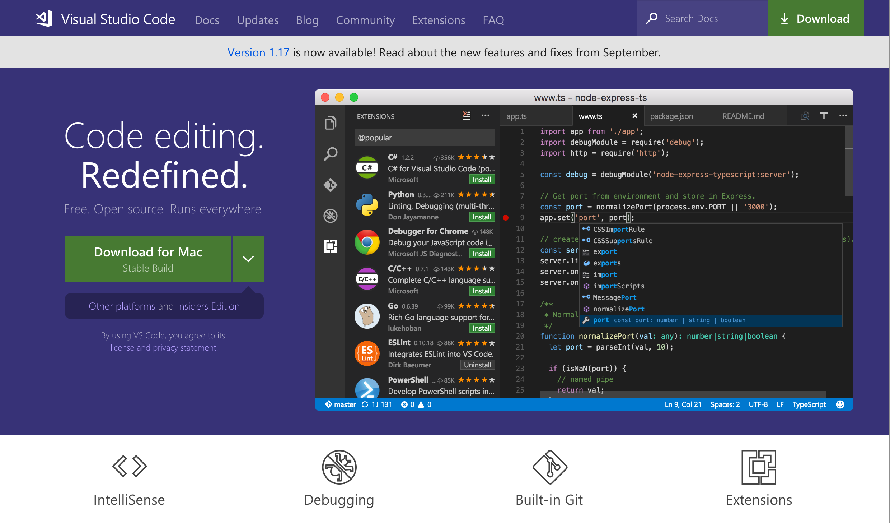
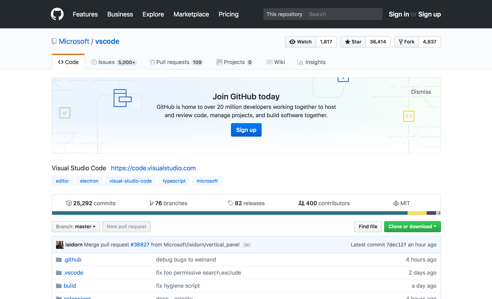
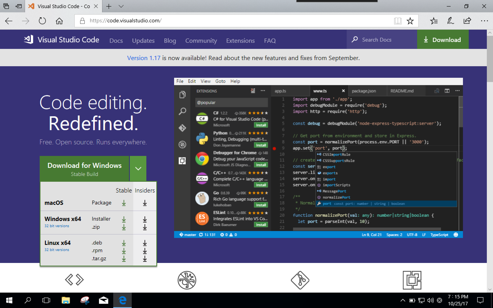
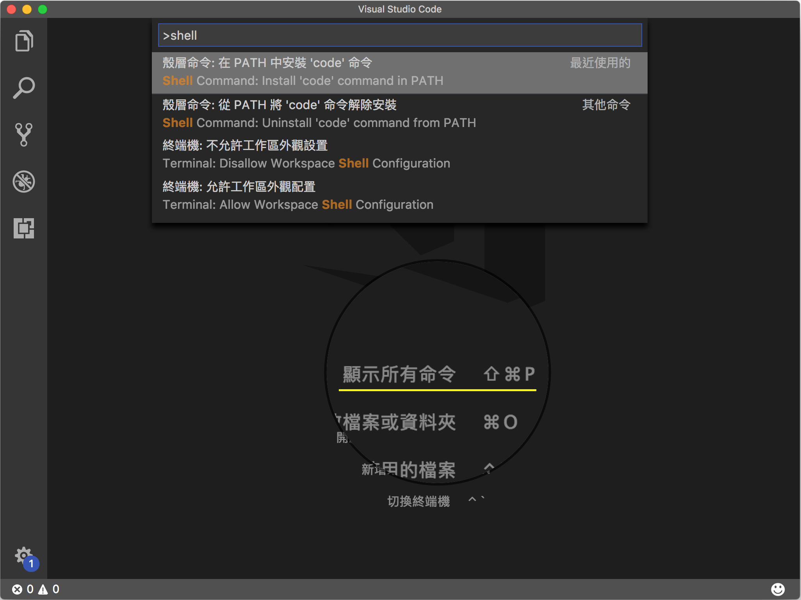

# 【vscode】來使用vscode開發吧(一)！

來到 MSP Blog 相信你一定是與程式學習相關的讀者，我想來向大家推薦一個非常好用的工具 -- vscode。  

[vscode 官方頁面](https://code.visualstudio.com) 
 

[vscode github 頁面](https://github.com/Microsoft/vscode)


## vscode 是什麼？
Visual Studio Code (vscode) 是微軟推出的一個開源文字編輯器。
與我們常聽到的 Visual Studio 不同，第一版自 2015/04 發佈就支持跨平台使用。
當時因為剛發佈使用者不多、功能陽春，但透過開源、支持插件，現今也持續快速成長。


>vscode 在 github 的貢獻數已經超過15k

## visual studio V.S vscode
自家人別打自家人啊！怎麼微軟出了兩個撰寫程式的工具呢！  
這沒有自家人打架的問題，兩個工具的使用的定位與時間是不一樣。

Visual Studio 有個地表最強 IDE 的稱號，自然有立足在這個位置的原因，完整的開發工具，近年來與 Azure 雲端開發、 Xamarin 跨平台開發。慢慢的變成一個大怪獸，把電腦裡的空間、資源都佔去了。

vscode 則是一個擁有強大功能的文字編輯器。與多數人使用的其他編輯器一樣，有高亮語法、安裝插件的功能，能支援多種程式語言。

讓我們在編寫程式時能夠輕量、便利的改寫程式碼，儘管少了一些整合好的便利功能，但可以透過去尋找擴充元件來補足。

## 為何不使用其他文字編輯器？
既然都說了有和其他編輯器一樣的功能，那用別的不也一樣嗎？

vscode 從發佈以來就是完全開源的，代表只要你有能力，你就可以為 vscode 增加其他功能，也因為是開源的，才能夠造 github contribute 速度攀升的如此之快。

而且和其他編輯器不同的就是，他在編輯器之外更是原生支援許多功能，這邊提到個人使用上最常用的兩個 git 與 debugger，這兩點有比較複雜的應用會在其他文章多做說明。

## 那我要在哪裡取得檔案安裝呢？
透過搜尋引擎打上 vscode 可以找到官方頁面，或是輸入[https://code.visualstudio.com](https://code.visualstudio.com) 就可以下載自己電腦使用的平台就可以安裝囉！
> 系統需求：  
> 硬體  
> 1.6 GHz CPU  
> 1 GB 記憶體  
> 200 MB 硬碟空間  
> 系統
> Windows 7 以上 + .NET famework 4.5  
> Mac OS X Yosemite  
> Linux（Deian, Rat Hat 系列）  



## 讓 vscode 更便利吧！
電腦操作可以使用鍵盤、滑鼠、觸控螢幕，甚至是繪圖板！但是當在撰寫程式時不斷的從滑鼠與鍵盤切換會拖慢效率。

為了能快速從終端機開起 vscode 我們要先將 code 加入環境變數中，只有 Mac 系統需要設定，Windows, Linux 安裝完成會自動加入。

設定方法按下 Command+Shift+P（⌘+⇧+P），輸入 shell command，選擇在 PATH 中安裝 'code' 命令。


現在在終端機視窗中，輸入 'code .' 就可快速用 vscode 開啟專案。

## 常用快捷鍵
```
vscode 有許多與其他軟體相同的快捷鍵就不額外贅述了。
如：開新檔案、儲存、剪下、複製、貼上。
```

通用：  
功能|Windows 快捷鍵|Mac 快捷鍵
-|-|-
|開啟 Command Palette|Ctrl+Shift+P|Command+Shift+P|
|尋找檔案|Ctrl+P|Command+P|
|尋找文字|Ctrl+F|Command+F|
|切換最近的檔案|Ctrl[+Shift]+Tab|Command[+Shift]+Tab|
|分割工作視窗|Ctrl+\\|Command+\\|
|分割視窗切換|Ctrl+1~3|Command+1~3|
|快速選取|Ctrl+D|Command+D|

Viewbar 切換：  
|功能|Windows 快捷鍵|Mac 快捷鍵|
|-|-|-|
|將 Sidebar 顯示/隱藏|Ctrl+B|Command+B|
|將 Sidebar 切換為 Explorer|Ctrl+Shift+E|Command+Shift+E|
|將 Sidebar 切換為 Search|Ctrl+Shift+F|Command+Shift+F|
|將 Sidebar 切換為 Source Control|Ctrl+Shift+G|Ctrl+Shift+G|
|將 Sidebar 切換為 Debug|Ctrl+Shift+D|Command+Shift+D|
|將 Sidebar 切換為 Extentions|Ctrl+Shift+X|Command+Shift+X|

編輯：  
|功能|Windows 快捷鍵|Mac 快捷鍵|
|-|-|-|
|新增游標|Alt+Click|Option+Click|
|移動整行程式碼|Alt+up[or down]|Option+up[or down]|


參考資料：  
- Visual Studio Code 快速上手指南：
https://www.slideshare.net/shengyou/visual-studio-code-62532711  

- vscode shortcut：
[windows](https://code.visualstudio.com/shortcuts/keyboard-shortcuts-windows.pdf)、
[mac](https://code.visualstudio.com/shortcuts/keyboard-shortcuts-macos.pdf)、
[linux](https://code.visualstudio.com/shortcuts/keyboard-shortcuts-linux.pdf)  
- Visual Studio Code 簡介：
https://channel9.msdn.com/Series/Mastering-Visual-Studio-Code