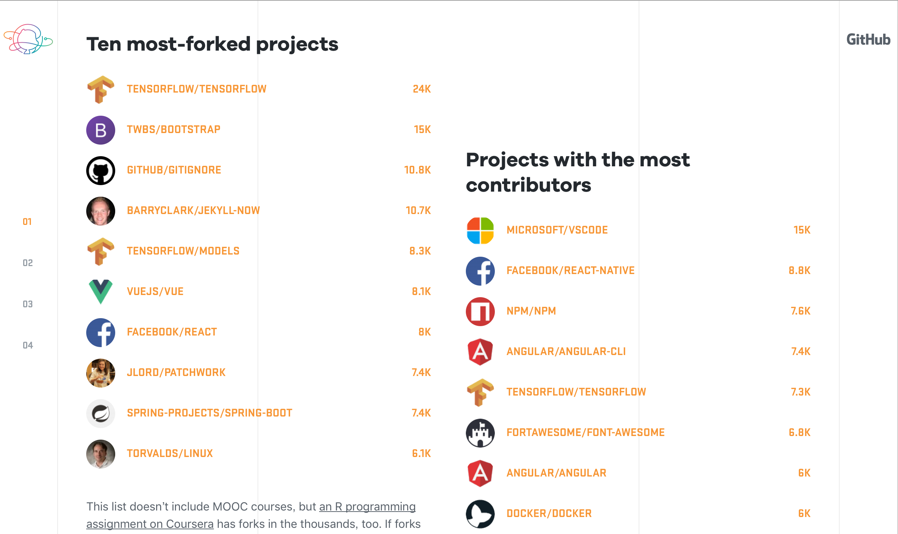

【vscode】來使用vscode開發吧！
===
來到 MSP Blog 相信你一定是與程式學習相關的讀者，我想來向大家推薦一個非常好用的工具--vscode。  

[vscode 官方頁面](https://code.visualstudio.com)  
[vscode github 頁面](https://github.com/Microsoft/vscode)

# vscode 是什麼？
Visual Studio Code (vscode) 是微軟推出的一個開源文字編輯器。
與我們常聽到的 Visual Studio 不同，第一版自 2015/04 發佈就支持在不同作業系統使用。
當時因為剛發佈使用者不多，但透過開源、支持插件，現今也持續快速成長。

>vscode 在 github 的貢獻數已經超過15k

# visual studio V.S vscode
自家人別打自家人啊！怎麼微軟出了兩個撰寫程式的工具呢！
這根本不是自家人打架的問題，兩個工具的定位完全不一樣。

Visual Studio 有個地表最強 IDE 的稱號，自然有立足在這個位置的原因，完整的開發工具，近年來與 Azure 雲端開發、 Xamarin 跨平台開發。慢慢的變成一個大怪獸，把電腦裡的空間、資源都佔去了。

vscode 則是一個擁有強大功能的文字編輯器。與多數人使用的其他編輯器一樣，有高亮語法、安裝插件的功能，能支援多種程式語言。

# 為何不使用其他文字編輯器？
既然都說了有和其他編輯器一樣的功能，那用別的不也一樣嗎？

vscode 從發佈以來就是完全開源的，代表只要你有能力，你就可以為 vscode 增加其他功能，也因為是開源的，才能夠造 github contribute 速度攀升的如此之快。

而且和其他編輯器不同的就是，他在編輯器之外更是原生支援許多功能，這邊提到個人使用上最常用的兩個 git 與 debugger，這兩點有比較複雜的應用會再更後面多做說明。
